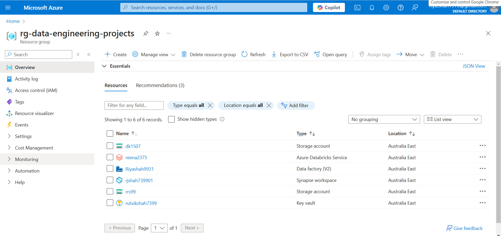
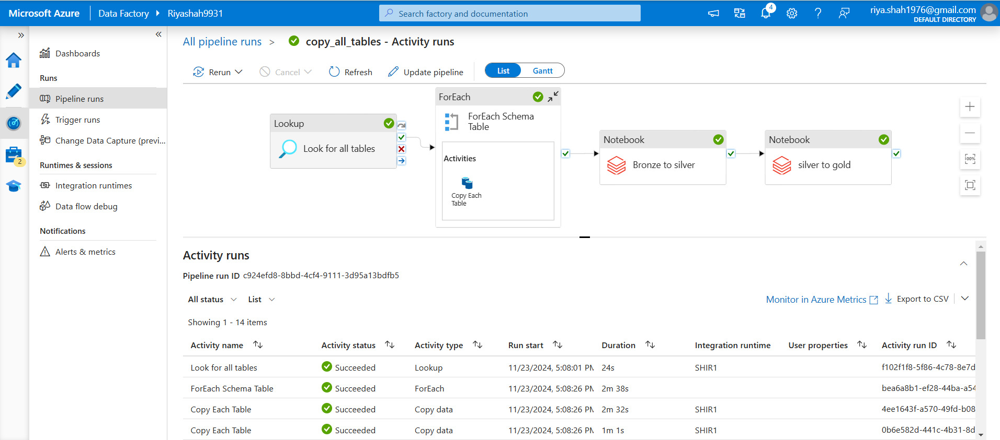
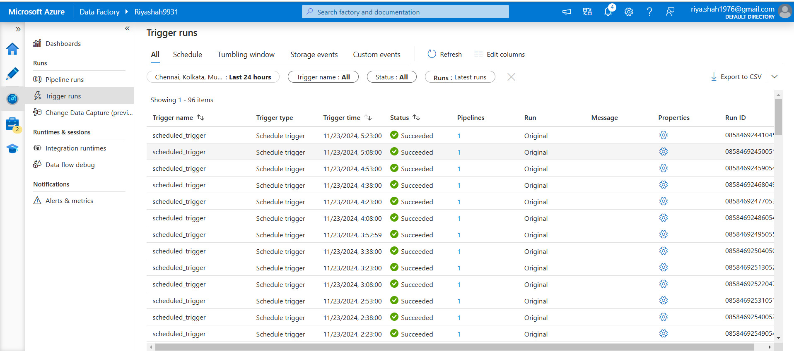
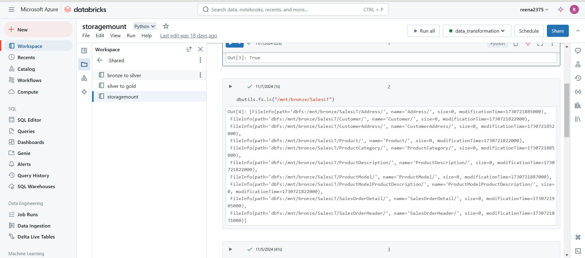
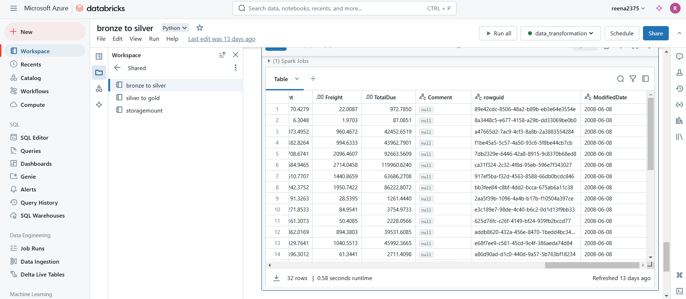
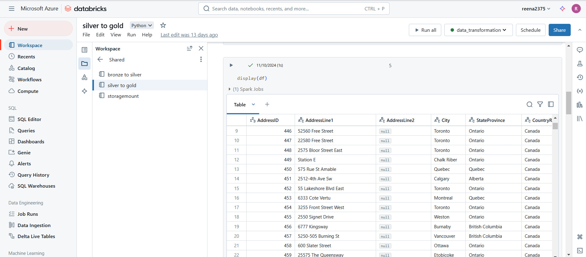
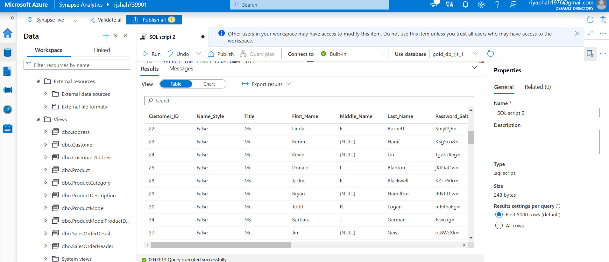
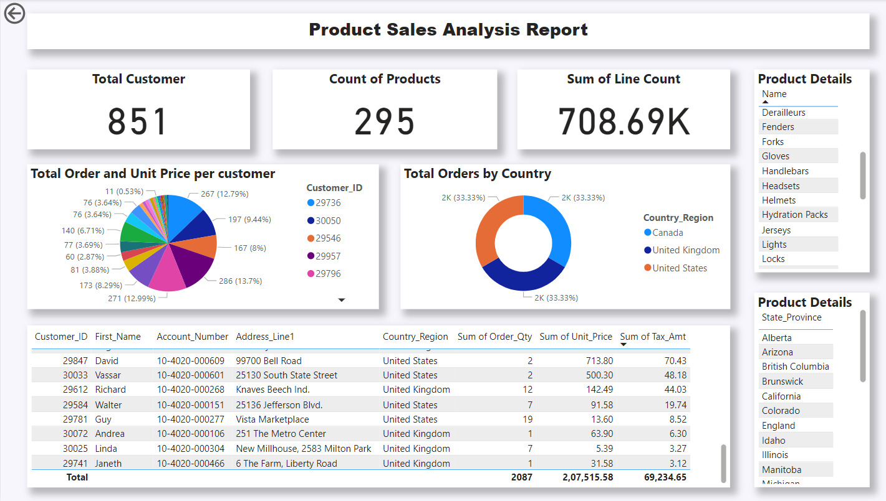

## 🚀 Resourse Setup

We have established the foundational prerequisites required to execute the project.

## 👨‍💻 **Tasks Overview** 

- **Data**: Open-source data provided by Microsoft Azure was utilized for this project [see here](https://learn.microsoft.com/en-us/sql/samples/adventureworks-install-configure?view=sql-server-ver16&tabs=ssms).  
- **Microsoft Integration Runtime**: Used to establish a communication channel between the local SSMS server and Azure Data Factory (ADF).  
- **Resource Group**: A resource group was created in Azure to serve as a centralized hub for resources, enabling shared access and seamless integration.  

## 📸 Snapshots

## 🚀 Data Ingestion  

In this project, we leveraged **Azure Data Factory (ADF)** to source data from **SQL Server Management Studio (SSMS)** into the Azure cloud. The ingested data is stored in containers, which are further utilized in subsequent stages of the pipeline.  

## 👨‍💻 **Tasks Overview**  

### **Containers**  
We created three containers to structure the data, each storing information in **Parquet file format**:  
- **Bronze Container**: Contains raw data imported directly from SSMS.  
- **Silver Container**: Holds data with minimal transformations applied to the Bronze layer.  
- **Gold Container**: Contains highly refined and fully transformed data sourced from the Silver layer.  

### **Pipelines**  
A robust pipeline was built to streamline the data ingestion process.  
- The pipeline extracts data from SSMS tables as the source.  
- It applies a **lookup operation** for each table.  
- The processed data is then ingested into the specified folder paths within the containers, stored in **Parquet format**.  

This setup ensures an efficient and organized approach to data handling, paving the way for seamless transformation and analysis in the cloud.

## 📸 Snapshots

## 🚀 Data Transformation

We utilized **Azure Databricks** to execute pipelines using **PySpark**. These pipelines are designed to process newly arrived data in the containers created by ADF, apply a series of transformations, and load the processed data into the appropriate containers.

## 👨‍💻 **Tasks Overview**  

We leveraged **Azure Databricks** to execute pipelines using **PySpark**. These pipelines are designed to process newly arrived data in the containers created by ADF, apply a series of transformations, and load the processed data into the appropriate containers.  

### **Pipelines Overview**  

1. **Storage Mount Pipeline**:  
   This pipeline creates a storage mount within the Databricks workspace, enabling access to the data required for transformations.  

2. **Bronze to Silver Pipeline**:  
   Reads raw data from the Bronze container (imported via ADF from SSMS), applies basic transformations, and loads the transformed data into the Silver container.  

3. **Silver to Gold Pipeline**:  
   Takes data from the Silver container, performs advanced transformations, and loads the refined results into the Gold container.  

### Output Format
- The output of each pipeline is stored in **Parquet format**, ensuring efficient storage and compatibility for downstream processing.

## 📸 Snapshots

## 🚀 Data Load

We utilized **Synapse Analytics** to create views on top of the data stored in the **Gold container** within the data warehouse. These views dynamically reflect the latest data as new records arrive in the container, ensuring real-time updates when results are fetched. 

In this context, the views do not store physical data; instead, they act as a virtual representation or an abstraction layer over the container's data.
## 👨‍💻 **Tasks Overview** 

To simplify and automate the process, we developed a **stored procedure** that iterates through all the tables stored in the containers and creates views based on the data. This is achieved by establishing a direct connection to the containers, ensuring seamless integration and efficient view creation.

## 📸 Snapshots

## 🚀 Data Reporting

In this section, we designed a **Power BI report** to provide analytics and insights derived from the final output data. The report includes an interactive toolbar, allowing users to select a specific value and dynamically update all visuals to display corresponding results.

## 👨‍💻 **Tasks Overview** 

We created three types of visuals in the report:  

- **Table**: Displays detailed information about product sales, customers, and addresses based on dynamically selected product values.  
- **Pie Chart and Donut Chart**: Visualize the total units of products sold, categorized by region and country.  
- **Number Bars**: Highlight key metrics, including the total number of customers, product sales, and related details.  

## 📸 Snapshots

